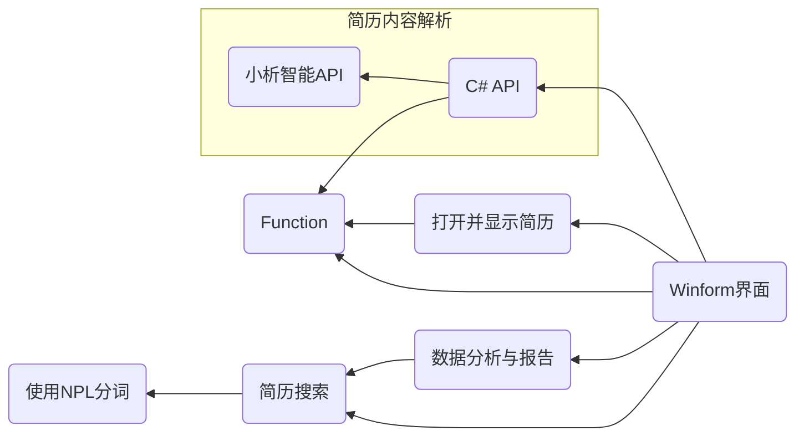

> 下一篇 [C# API](./Csharp-API)

## 项目调用情况

## 里程碑

- [ ] 前端页面
- [ ] C#API
- [x] Models
- [ ] 数据报告图像渲染
- [x] 文件打开与显示
- [ ] 数据库访问

## 模块介绍

### 功能清单

1. **简历导入与管理**
   1. $\checkmark$支持格式：系统应支持常见的简历格式，包括但不限于Word（.doc, .docx）、PDF和纯文本（.txt）
   2. $\checkmark$导入方式：允许用户通过拖拽、点击上传等方式单个或批量提交简历。
   3. 存储与检索：可按导入日期，文件名称等方式查询简历。可根据用户的选择，打开并显示一份简历文件。

2. **简历解析与结构化**
   1. 内容提取：自动从简历中提取求职者信息，如姓名、联系方式、教育背景、工作经历、技能等。
   2. 数据结构化：为用户提供多种简历解析数据的格式，包括但不限于JSON、CSV、XML。
   3. 格式转换：支持将解析后的一种简历数据格式转换为其他格式。

3. **简历匹配与筛选**
   1. 关键词匹配：允许用户设定关键词，系统根据关键词自动筛选符合条件的简历。
   2. 语义匹配：利用NLP技术，实现简历与职位描述之间的语义匹配，提高筛选的准确性。
   3. 技能评估：根据求职者简历中的技能描述，评估其技能熟练度，并给出相应的评分。

4. **数据分析与报告**
   1. 统计分析：对简历数据进行统计分析，如求职者年龄分布、学历分布、技能分布等。
   2. 报告生成：提供可视化报告，以图表形式展示分析结果，并配以文字介绍。

### 窗体部分

提供用户操作界面即简单逻辑，略

### 搜索部分

提供一些类搜索引擎的功能，如通过文件名检索，通过关键字检索

### 数据分析与报告

详见 `详细设计`

### 类模型

#### 简历实体

- 类型名:  `ResumeFile`

- 字段:

  |    属性名    |    类型    |        解释        |
  | :----------: | :--------: | :----------------: |
  |     `id`     |   `int`    |       实体id       |
  |  `filename`  |  `string`  |       文件名       |
  | `Base64Data` |  `string`  | 文件Base64编码内容 |
  |    `date`    | `DateTime` |      导入日期      |

#### 简历信息实体

- 类型名: `ResumeImfo`
- 字段:
  - `BaseImfo`
  - `EduBG`
  - `WorkExper`

#### 关键字实体

- 类型名:   `KeyWord`

- 字段:

  | 属性名 |   类型   |  解释   |
  | :----: | :------: | :-----: |
  |  `id`  |  `int`   | 实体 id |
  | `word` | `string` | 关键字  |

****

> 下一篇 [C# API](./Csharp-API)