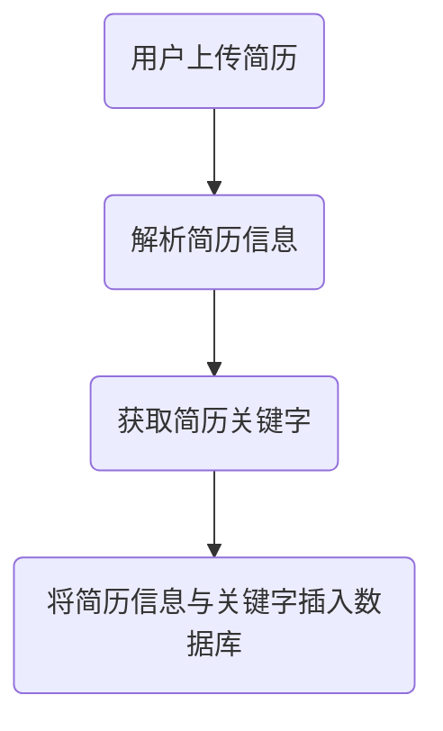

> ### 即为实现项目中特定功能而新加的方法

由于本项目中简历文件与关键字插入时有更加特殊的关系插入需求，故需要针对该部分需求设计其对应的特定方法

### 关于简历文件信息在插入时为*一対多*情况的设计

首先，由于在插入一条数据的驱动过程是：



故，会涉及到一个简历与多个关键字关联的情况，以下是详细设计


> ### 批量插入关键字函数
> 
> ```csharp
> List<int> Insert(List<string> KeyWords);
> List<int> Insert(string[] KeyWords);// 重载
> ```
> 
> - **传入参数**：与简历关联的一组关键字
> - **返回值**：插入的这一组关键字对应的实体`ID`
> 
> 该函数用于插入与简历匹配的一组关键字
> 
> 其中，当前插入的简历所对应的关键字，可能已经存在于数据库中，对于这种情况，在插入是应该进行判断。
> 
> 另外，如果数据库中还未包含该关键字实体，应该将该关键字实体插入数据库中，并返回该关键字实体`ID`。


> ### 批量创建 简历-关键字 关系表
> 
> ```csharp
> bool Insert(int FileID, List<int> KeysID);
> ```
> 
> - **传入参数**：
>   - `FileID`：简历文件数据库实体`ID`
>   - `KeysID`：与简历关联的所有关键字的`ID`
> - **返回值**：是否插入成功
> 
> 该函数用于将多个关键字绑定在当前操作的简历上，以提供数据库层面的搜索引擎服务。

